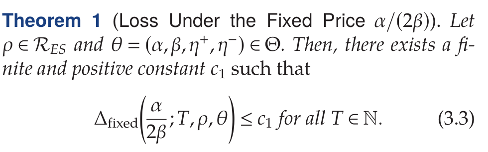
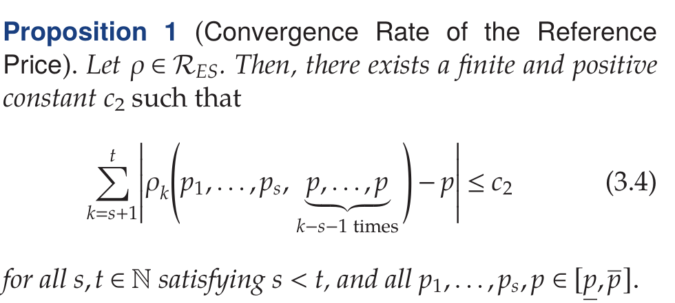
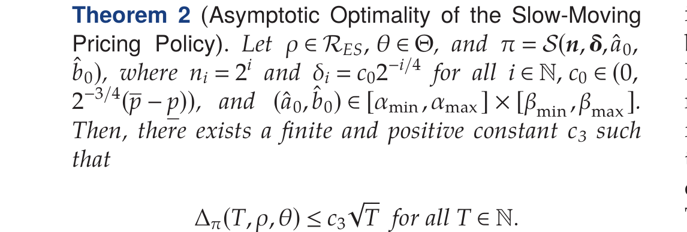
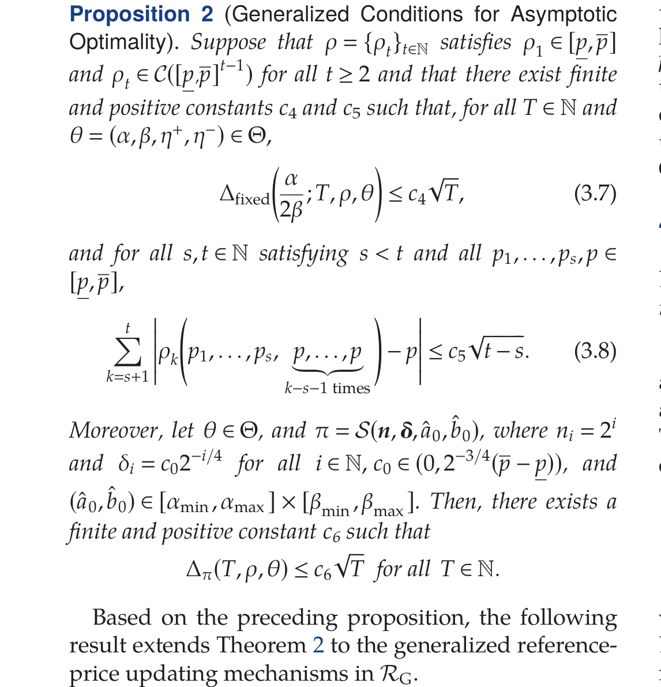
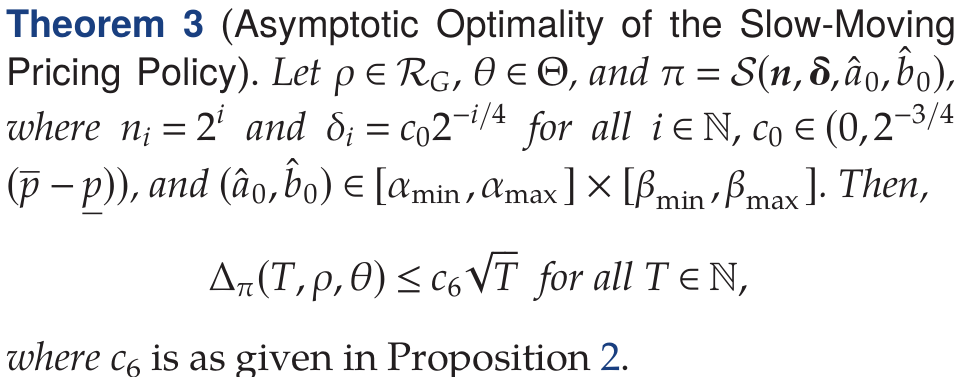
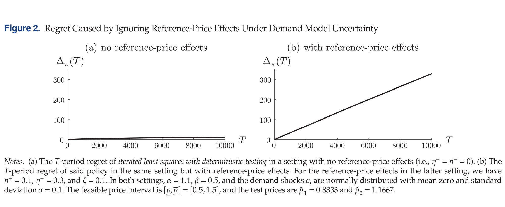
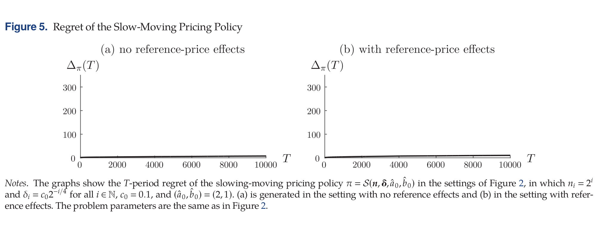
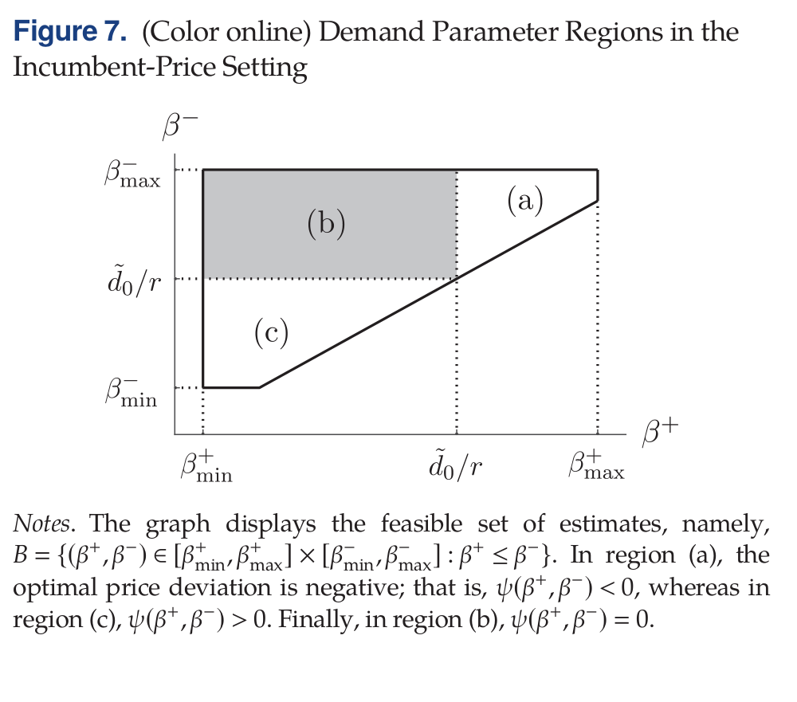

# 具有需求学习与参考价格效应的动态定价

- 作者：Arnoud V. den Boer；N. Bora Keskin
- 学校：阿姆斯特丹大学（Korteweg-de Vries Institute for Mathematics 与 Amsterdam Business School）；杜克大学（Fuqua School of Business）
- 关键词：参考价格效应；动态定价；序贯估计；学习与收益权衡（learning and earning）
- DOI / 论文链接：https://doi.org/10.1287/mnsc.2021.4234

## 1. 研究背景、问题定义与核心思路
### 1.1 研究动机与关键挑战
论文关注一个现实但困难的定价场景：卖家既要动态调价，又要在线学习需求参数，同时消费者存在参考价格效应。其关键挑战在于：
1. 价格试探会改变参考价格轨迹，进而反过来污染参数估计。
2. 卖家看不到参考价格状态，只能通过销量间接推断。
3. 若直接套用“无参考效应”下的经典学习定价策略，可能在有参考效应时产生系统性模型失配。

### 1.2 方法框架与核心思路
论文从统一随机需求模型出发，把“学习”和“参考效应控制”放到同一 regret 框架中：

$$
d_t = d(p_t, r_t) + \epsilon_t.
$$

其中需求函数为（文中式 (2.2)）：

$$
d(p,r) = \alpha - \beta p + \eta_+(r-p)^+ - \eta_-(p-r)^+
= \begin{cases}
\alpha - \beta p + \eta_+(r-p), & p < r,\\
\alpha - \beta p - \eta_-(p-r), & p \ge r.
\end{cases}
$$

当采用指数平滑参考价机制时：

$$
r_{t+1} = \zeta r_t + (1-\zeta)p_t.
$$

性能指标为累计 regret（相对全信息 clairvoyant）：

$$
\Delta_\pi(T,\rho,\theta) = \Pi^*(T,\rho,\theta) - \mathbb{E}_\pi\!\left[\sum_{t=1}^T R(p_t,r_t,\theta)\right].
$$

论文核心策略是“慢变化价格”思想：用渐进且可控的价格试探减小参考价波动，把参考效应导致的模型偏差压到可管理范围，再做参数学习与优化更新。

### 1.3 主要创新点
1. **揭示“可忽略性错觉”**：在全信息条件下参考效应影响可小，但在参数未知时，忽略参考效应会导致显著性能退化。
2. **提出慢变化学习定价策略并给出最优阶保证**：在时变参考价下实现 $\mathcal{O}(\sqrt{T})$ regret，与下界同阶。
3. **推广到更一般参考价过程**：允许参考价更新系数与过程发生跳变，在约束跳变频率条件下仍保持同阶最优结论。
4. **刻画固定参考价场景的复杂性**：说明该场景下最优可达阶与无参考效应时有本质差异，并给出配套策略。

## 2. 核心方法与技术主线解析
### 2.1 整体技术路线
论文的理论主线可概括为：
1. 先证明在指数平滑参考价下，固定价格基准损失可界（Theorem 1）。
2. 再证明参考价在“价格保持常值”时具有可控收敛规律（Proposition 1）。
3. 基于以上两点构造慢变化策略并证明其 regret 上界为 $\mathcal{O}(\sqrt{T})$（Theorem 2）。
4. 进一步抽象出更一般条件（Proposition 2），并据此把结论扩展到广义参考价更新过程（Theorem 3）。

### 2.2 关键技术块解析
**块 A：Theorem 1（固定价格基准损失有界）**

该结果给出一个关键事实：在全信息前提下，始终收取 $\alpha/(2\beta)$ 的累计损失有上界常数控制。它不是最终策略本身，而是**比较基准**：告诉我们“若只看最优控制且已知参数，参考效应不一定灾难性”。

**块 B：Proposition 1（参考价收敛速率）**

该命题刻画了当价格在一段时间内保持稳定时，参考价轨迹会向该价格靠拢并满足可求和控制。它直接**支撑**慢变化策略的设计逻辑：先稳住参考价，再学习参数，减少“试探价格引起的状态扰动”。

**块 C：Theorem 2（慢变化策略的渐近最优性）**

在 Theorem 1 + Proposition 1 的链式支撑下，论文证明慢变化策略达到 $\mathcal{O}(\sqrt{T})$ regret。这里的保证是主结论之一：在未知需求参数、不可观测参考价下仍可达到最优量级。

**块 D：Proposition 2（广义条件抽象）**

该命题把“可证明最优性”从指数平滑特例抽象为两类条件：固定价格损失控制与参考价过程偏离控制。它在理论上起到**桥接作用**，把具体机理与一般过程类连接起来。

**块 E：Theorem 3（广义过程下的最优阶延拓）**

Theorem 3 明确**引用并继承** Proposition 2 的常数结构，在更一般的参考价过程类上延续 $\mathcal{O}(\sqrt{T})$ regret 结论，说明方法不依赖于单一更新公式，具有机制鲁棒性。

## 3. 仿真结果与对比分析
### 3.1 仿真设置与对比对象
论文主要比较三类证据：
1. 忽略参考效应策略在“无参考效应/有参考效应”两环境中的 regret 曲线差异。
2. 慢变化策略在同样环境下的表现稳定性。
3. 固定参考价场景中参数区域结构（用于解释为什么学习难度提升）。

### 3.2 主要结果与对比说明
**证据 1：Figure 2（忽略参考效应的代价）**

(a) 中（无参考效应）regret 增长较慢；(b) 中（有参考效应）出现近线性增长。该对比直接证明：同一学习策略在模型失配时会显著劣化，结论不是“略差”，而是量级变化。

**证据 2：Figure 5（慢变化策略的鲁棒性）**

两种环境下曲线都保持低增长量级，支持理论中的最优阶主张。与 Figure 2 对照可见，改进点不在“调参”，而在“把参考价动态纳入策略设计”。

**证据 3：Figure 7（固定参考价下参数区域结构）**

图中区域划分解释了为何在固定参考价问题里学习可能更难：最优价格偏移在参数空间中呈分段结构，导致某些区域信息获取效率低，进而抬高探索代价。该证据与文中下界讨论相互印证。

## 4. 面向不同对象的后续建议
1. 面向入门者
   标题：先掌握“regret + 参考价状态”的统一建模
   *核心建议：* 先复现文中式 (2.1)/(2.2)/(2.4)/(2.8) 的变量含义与因果链，再用 Figure 2 与 Figure 5 对照理解“为什么策略结构比参数微调更关键”。
   数学推导难度：中
2. 面向硕博学生
   标题：沿“广义参考价过程”做可识别性与最优阶扩展
   *核心建议：* 从 Proposition 2 的条件化抽象出发，研究更弱可观测条件（如部分状态观测、延迟反馈）下是否还能保持 $\mathcal{O}(\sqrt{T})$，重点放在下界构造与可达策略匹配。
   数学推导难度：高
3. 面向教授
   标题：以“双轨研究任务”组织学生工作流
   *核心建议：* 可将学生分为“理论轨（下界/最优阶证明）”与“算法轨（策略实现/鲁棒仿真）”，并以 Figure 2/5/7 作为统一评测基准，避免只做经验曲线而缺少可证结论。
   数学推导难度：很高

## 5. 总结与评价
该文的核心价值在于：它把“参考效应导致的状态演化”与“在线学习导致的估计误差”放进同一 regret 理论框架，明确展示了忽略参考效应会造成量级退化，并提供了具有可证明最优阶的慢变化策略。进一步地，作者把结论推广到更一般参考价过程，说明方法具有结构鲁棒性。对数据驱动定价研究而言，这篇论文的重要启发是：**策略是否显式管理行为状态变量（如参考价）**，往往比局部估计精度提升更决定长期收益上界。
