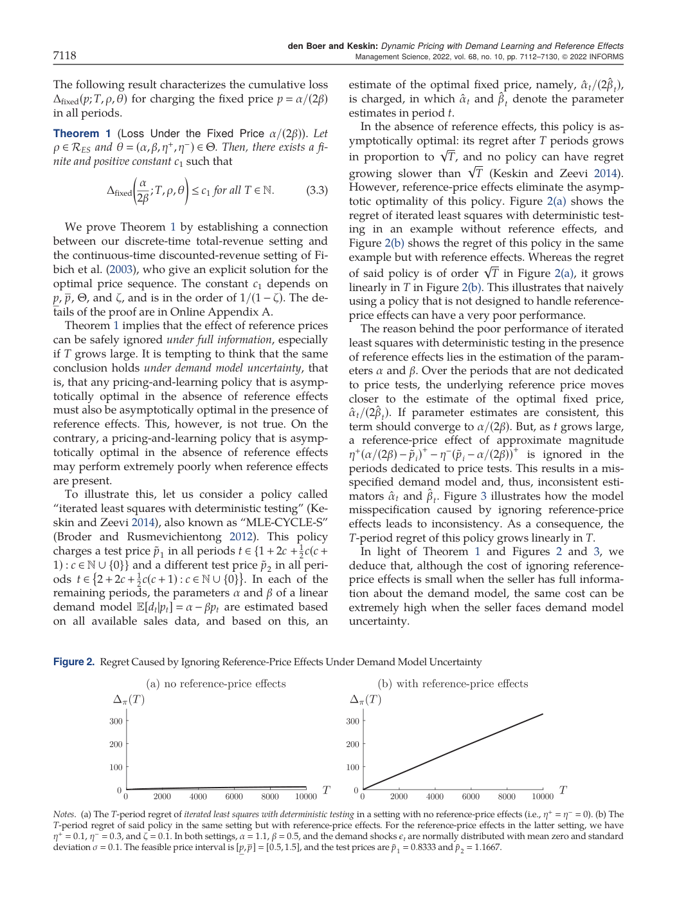
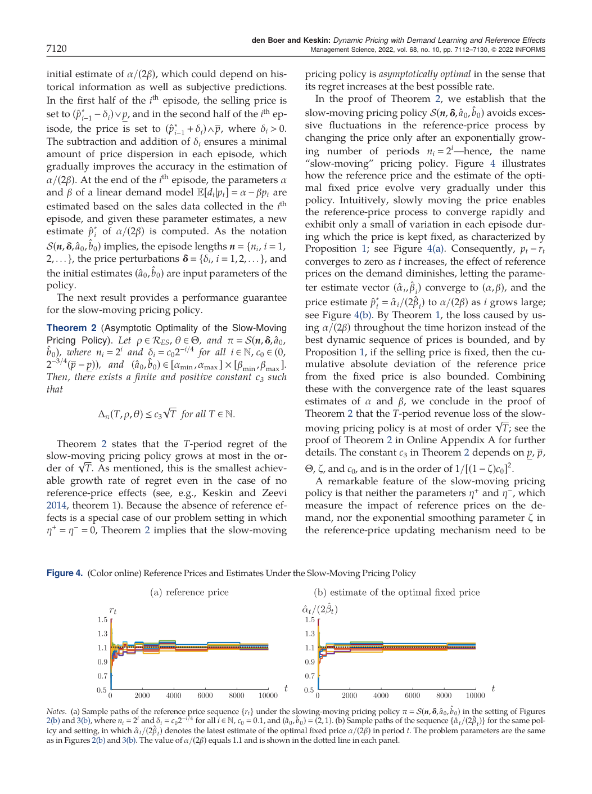
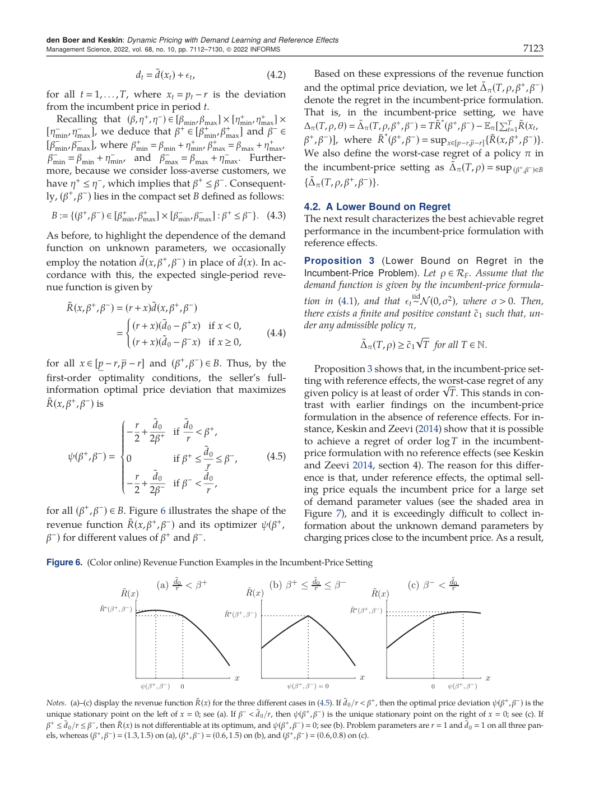
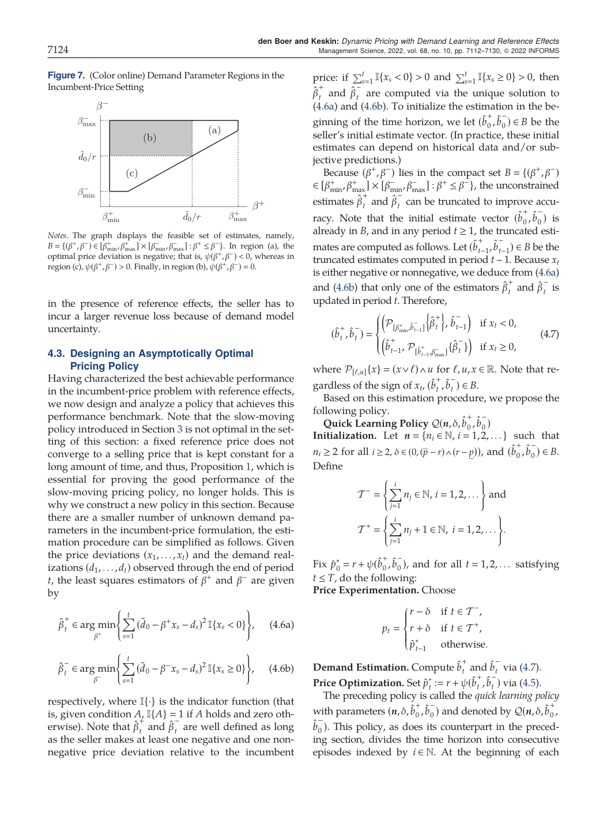
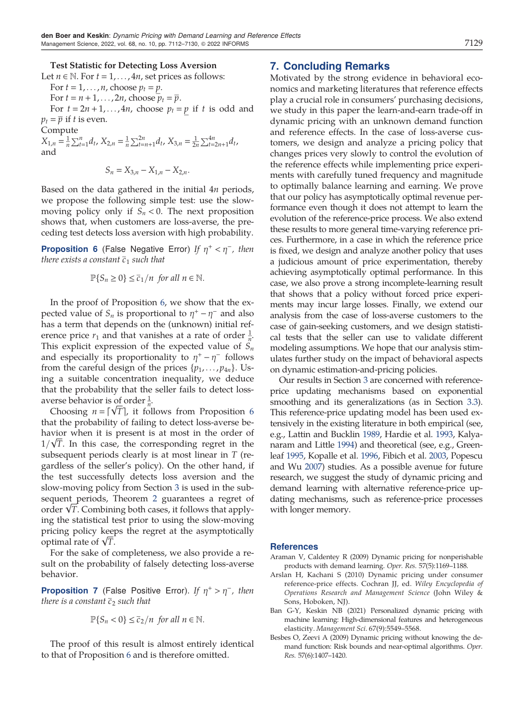

# Dynamic Pricing with Demand Learning and Reference Effects 复现导向文献报告

> 目标：将论文的运筹学模型、关键公式、算法结构、实验逻辑和复现计划整理成 Codex 可读取的 Markdown 文档。本文只依据已上传论文 PDF 的正文内容进行归纳，不把未确认信息写成论文事实。

## 0. 论文基本信息

| 字段 | 内容 |
|---|---|
| 论文题目 | Dynamic Pricing with Demand Learning and Reference Effects |
| 作者 | Arnoud V. den Boer, N. Bora Keskin |
| 期刊 | Management Science |
| 卷期页码 | Vol. 68, No. 10, pp. 7112-7130 |
| 发表时间 | 2022 |
| 研究关键词 | dynamic pricing, reference-price effect, sequential estimation, learning and earning, regret |
| 复现类型 | 理论模型复现 + 策略仿真 + 图表复现 |

## 1. 研究背景与核心问题

动态定价问题中，需求不只受当前价格影响，还会受消费者的参考价格影响。参考价格可以理解为消费者基于历史价格形成的心理价格锚点。当当前价格高于参考价格时，消费者感知为 loss；当当前价格低于参考价格时，消费者感知为 gain。论文把这种行为效应纳入动态定价，并进一步考虑卖方不知道需求函数参数，需要通过销售数据边学习边定价。

论文研究的核心困难有三点：

1. **需求函数存在 kink**：当价格等于参考价格时，需求函数左右斜率不同，导致非光滑优化问题。
2. **参考价格不可观测**：卖方只能看到自己设置的价格和实现需求，无法直接观测消费者参考价格。
3. **学习会扰动状态**：价格实验有助于估计需求参数，但频繁价格实验会改变参考价格过程，进而污染后续需求样本。

论文的主要目标是设计动态定价策略，使其在未知需求参数和参考价格效应同时存在时，累计 regret 达到最优增长阶。

## 2. 基础模型

### 2.1 时间、价格与需求

销售期共 $T$ 个离散时期。第 $t$ 期开始时，卖方设置价格：

$$
p_t \in [\underline p, \bar p]
$$

随后观察需求 $d_t$，并获得收入 $p_t d_t$。需求由当前价格、参考价格和随机扰动共同决定：

$$
d_t = d(p_t, r_t) + \varepsilon_t
$$

其中：

- $p_t$：第 $t$ 期价格。
- $r_t$：第 $t$ 期开始时的参考价格。
- $\varepsilon_t$：零均值独立同分布需求冲击。
- $d(p_t, r_t)$：条件期望需求。

### 2.2 带参考价格效应的需求函数

论文使用分段线性需求函数：

$$
d(p,r) = \alpha - \beta p + \eta^+ (r-p)^+ - \eta^- (p-r)^+
$$

其中：

$$
(x)^+ = \max\{x,0\}
$$

等价地，需求函数可写成：

$$
d(p,r)=
\begin{cases}
\alpha - \beta p + \eta^+(r-p), & p < r, \\
\alpha - \beta p - \eta^-(p-r), & p \ge r.
\end{cases}
$$

参数含义如下：

| 参数 | 含义 |
|---|---|
| $\alpha$ | 市场规模或基础需求水平 |
| $\beta$ | 消费者对当前价格的基础敏感度 |
| $\eta^+$ | 当前价格低于参考价格时，gain 对需求的正向影响系数 |
| $\eta^-$ | 当前价格高于参考价格时，loss 对需求的负向影响系数 |

loss-averse 情形对应：

$$
\eta^+ \le \eta^-
$$

gain-seeking 情形对应：

$$
\eta^+ > \eta^-
$$

### 2.3 单期收入函数

给定价格 $p$、参考价格 $r$ 和参数 $\theta = (\alpha, \beta, \eta^+, \eta^-)$，单期望收入为：

$$
R(p,r,\theta) = p \cdot d(p,r,\theta)
$$

如果忽略参考价格效应，即 $\eta^+ = \eta^- = 0$，则需求退化为：

$$
d(p)=\alpha - \beta p
$$

单期收入为：

$$
R(p)=p(\alpha - \beta p)
$$

一阶条件给出无参考价格效应时的静态最优价格：

$$
p^\star = \frac{\alpha}{2\beta}
$$

该价格是论文多个策略设计的核心锚点。

## 3. 参考价格更新机制

论文首先分析 time-varying reference price。基础设定采用指数平滑机制：

$$
r_{t+1} = \zeta r_t + (1-\zeta)p_t, \qquad \zeta \in [0,1)
$$

其中 $\zeta$ 是参考价格更新速度参数：

- $\zeta = 0$ 时，参考价格完全等于上一期价格。
- $\zeta$ 越接近 1，参考价格变化越慢。
- 卖方不知道 $\zeta$ 的具体值。

若从某一时期开始连续固定价格 $p$，则参考价格会以几何速度靠近 $p$。这一性质是 slow-moving pricing policy 的基础。

## 4. Regret 定义与性能目标

论文用 regret 衡量策略表现。clairvoyant benchmark 是知道真实需求参数和参考价格更新机制的最优决策者。

全信息最优累计收入为：

$$
\Pi^\star(T,\rho,\theta)
= \sup_{(p_1,\ldots,p_T)\in[\underline p,\bar p]^T}
\sum_{t=1}^{T} R\bigl(p_t, \rho_t(p_1,\ldots,p_{t-1}), \theta\bigr)
$$

策略 $\pi$ 的 regret 定义为：

$$
\Delta_\pi(T,\rho,\theta)
= \Pi^\star(T,\rho,\theta)
- \mathbb{E}_\pi\left[\sum_{t=1}^{T} R(p_t,r_t,\theta)\right]
$$

论文追求的是 regret 的最优增长阶。由于无参考价格效应的未知需求动态定价问题也存在 $\Omega(\sqrt{T})$ 下界，因此若策略达到：

$$
\Delta_\pi(T,\rho,\theta) = O(\sqrt{T})
$$

则在 loss-averse time-varying reference price 设定下可以视为渐近最优。

## 5. 忽略参考价格效应为什么会失败

论文先讨论一个看似自然的做法：直接使用无参考价格效应下的动态学习定价策略，例如 iterated least squares with deterministic testing。该策略在无参考价格效应时可以达到 $O(\sqrt{T})$ regret。

但在存在参考价格效应时，频繁或固定的价格测试会让参考价格跟随历史价格变化。卖方若仍用简单线性模型：

$$
\mathbb{E}[d_t\mid p_t] \approx \alpha - \beta p_t
$$

就会把参考价格效应误写进 $\alpha$ 和 $\beta$ 的估计中，导致参数估计不一致。其后果是估计最优价格无法收敛到 $\alpha/(2\beta)$，累计 regret 可能接近线性增长。

**复现重点**：Figure 2 和 Figure 3 对应这一现象。Figure 2 展示无参考效应时 regret 为次线性，加入参考效应后 regret 变为接近线性。Figure 3 展示估计价格 $\hat\alpha_t/(2\hat\beta_t)$ 的收敛失败。



## 6. Slow-moving pricing policy

### 6.1 设计思想

slow-moving policy 的核心思想是：价格变化必须足够慢，使参考价格在每个 episode 内逐渐靠近当前价格，从而降低不可观测参考价格对需求估计的污染。

该策略同时做两件事：

1. 用越来越长的 episode 稳定参考价格。
2. 在每个 episode 内使用小幅双侧扰动，保证估计 $\alpha$ 和 $\beta$ 所需的价格差异。

### 6.2 Episode 设置

论文采用：

$$
n_i = 2^i
$$

$$
\delta_i = c_0 2^{-i/4}
$$

其中：

- $n_i$：第 $i$ 个 episode 的半段长度。
- $2n_i$：第 $i$ 个 episode 的总长度。
- $\delta_i$：第 $i$ 个 episode 的价格扰动幅度。
- $c_0$：正的扰动常数。

### 6.3 策略流程

第 $i$ 个 episode 开始前，已有上一轮估计：

$$
\hat p_{i-1}^\star = \frac{\hat\alpha_{i-1}}{2\hat\beta_{i-1}}
$$

第 $i$ 个 episode 前半段定价：

$$
p_t = \max\{\hat p_{i-1}^\star - \delta_i, \underline p\}
$$

第 $i$ 个 episode 后半段定价：

$$
p_t = \min\{\hat p_{i-1}^\star + \delta_i, \bar p\}
$$

episode 结束后，用该 episode 的销售数据拟合线性模型：

$$
(\hat\alpha_i, \hat\beta_i)
\in
\arg\min_{(\alpha,\beta)}
\sum_{s\in T_i^- \cup T_i^+}
(\alpha - \beta p_s - d_s)^2
$$

然后更新：

$$
\hat p_i^\star = \frac{\hat\alpha_i}{2\hat\beta_i}
$$

### 6.4 理论保证

论文证明，在指数平滑参考价格机制下，若采用上述 $n_i$ 和 $\delta_i$，则 slow-moving policy 的 regret 满足：

$$
\Delta_\pi(T,\rho,\theta) \le c_3 \sqrt{T}
$$

也就是：

$$
\Delta_\pi(T,\rho,\theta) = O(\sqrt{T})
$$

由于 $\Omega(\sqrt{T})$ 是该类问题的基本下界，论文称该策略为 asymptotically optimal。

Figure 4 展示 slow-moving policy 下参考价格和估计最优价格的逐步稳定过程。



## 7. 更一般的参考价格更新机制

论文进一步说明 slow-moving policy 不只适用于指数平滑机制。它可以推广到更一般的参考价格更新过程，只要满足两类条件：

### 7.1 固定价格相对全信息最优的损失受控

$$
\Delta^{\mathrm{fixed}}\left(\frac{\alpha}{2\beta};T,\rho,\theta\right)
\le c_4\sqrt{T}
$$

### 7.2 固定价格后参考价格偏差累计受控

$$
\sum_{k=s+1}^{t}
\left|
\rho_k(p_1,\ldots,p_s,p,\ldots,p)-p
\right|
\le c_5\sqrt{t-s}
$$

如果这两个条件成立，slow-moving policy 仍可得到 $O(\sqrt{T})$ regret。论文还给出一种允许参考价格跳变的机制，只要跳变次数在任意区间内不超过 $O(\sqrt{N})$ 量级，整体结论仍成立。

## 8. Fixed reference price 设定

### 8.1 问题动机

论文接着分析固定参考价格设定。该设定对应一种实际场景：卖方长期使用某个 incumbent price，消费者参考价格已经稳定在该价格附近，并且卖方已知该价格下的期望需求。

设固定参考价格为：

$$
r
$$

定义价格偏移量：

$$
x_t = p_t - r
$$

### 8.2 重新参数化

令：

$$
\tilde d_0 = d(r,r) = \alpha - \beta r
$$

$$
\beta^+ = \beta + \eta^+
$$

$$
\beta^- = \beta + \eta^-
$$

则需求可写为关于 $x$ 的分段线性函数：

$$
\tilde d(x)=
\begin{cases}
\tilde d_0 - \beta^+ x, & x < 0, \\
\tilde d_0 - \beta^- x, & x \ge 0.
\end{cases}
$$

对应收入函数：

$$
\tilde R(x,\beta^+,\beta^-)
= (r+x)\tilde d(x,\beta^+,\beta^-)
$$

### 8.3 最优偏移量

论文给出最优价格偏移函数 $\psi(\beta^+,\beta^-)$：

$$
\psi(\beta^+,\beta^-)=
\begin{cases}
-\dfrac{r}{2} + \dfrac{\tilde d_0}{2\beta^+}, & \dfrac{\tilde d_0}{r} < \beta^+, \\
0, & \beta^+ \le \dfrac{\tilde d_0}{r} \le \beta^-, \\
-\dfrac{r}{2} + \dfrac{\tilde d_0}{2\beta^-}, & \beta^- < \dfrac{\tilde d_0}{r}.
\end{cases}
$$

三个区域分别对应：

| 区域 | 最优行为 |
|---|---|
| $\tilde d_0/r < \beta^+$ | 最优价格低于参考价格，即 $x^\star < 0$ |
| $\beta^+ \le \tilde d_0/r \le \beta^-$ | 最优价格等于参考价格，即 $x^\star = 0$ |
| $\beta^- < \tilde d_0/r$ | 最优价格高于参考价格，即 $x^\star > 0$ |

Figure 6 展示分段收入函数形状，Figure 7 展示参数平面的三个区域。





## 9. Quick learning policy

### 9.1 设计动机

固定参考价格下，卖方需要学习左右两侧斜率 $\beta^+$ 和 $\beta^-$。由于 kink 位于 $x=0$，如果策略只在一侧采样，就无法学习另一侧斜率。因此 quick learning policy 显式安排左右两侧的价格实验。

### 9.2 策略结构

在每个 episode 中，策略使用三个价格类型：

1. 左侧测试价：

$$
p_t = r - \delta
$$

2. 右侧测试价：

$$
p_t = r + \delta
$$

3. 根据当前估计选择的 exploit 价格：

$$
p_t = r + \psi(\hat\beta_t^+,\hat\beta_t^-)
$$

当 $x_t < 0$ 时，样本用于更新 $\beta^+$；当 $x_t \ge 0$ 时，样本用于更新 $\beta^-$。

### 9.3 理论结论

论文证明 quick learning policy 在 fixed reference price 设定下达到：

$$
\Delta_\pi(T) = O(\sqrt{T})
$$

同时论文证明该设定下任意 admissible policy 的 regret 至少为：

$$
\Omega(\sqrt{T})
$$

因此 quick learning policy 在该设定下是渐近最优的。

## 10. Certainty equivalence 的 incomplete learning

论文特别指出，certainty equivalence 或其他 passive learning policy 在带参考价格效应的 fixed reference price 问题中会出现更严重的 incomplete learning。

核心机制如下：

1. 如果初始估计让策略认为最优偏移量 $\psi(\hat\beta^+,\hat\beta^-)$ 非负，则策略会长期选择 $x_t \ge 0$。
2. 这样只能更新右侧斜率 $\beta^-$。
3. 左侧斜率 $\beta^+$ 长期无法被采样和更新。
4. 如果真实最优区域实际在 $x^\star < 0$，策略仍可能永远无法发现。
5. 累计 regret 因而变为线性阶。

该结论说明 reference effect 会放大 passive learning 的失败。复现时建议构造一个真值位于 $x^\star < 0$ 区域、初始估计位于 $x^\star \ge 0$ 区域的例子，验证策略是否长期不跨越 kink。

## 11. Gain-seeking customer behavior

论文还分析 gain-seeking 情形，即：

$$
\eta^+ > \eta^-
$$

在该部分的主要设定中，论文考虑：

$$
\eta^- = 0, \qquad \eta^+ = \eta > 0, \qquad \zeta = 0
$$

gain-seeking 消费者会更强烈响应价格低于参考价格时的 gain。全信息最优策略通常呈现循环降价式 price skimming。

### 11.1 循环收入函数

对长度为 $m$ 的单调不增价格循环：

$$
p_1 \ge p_2 \ge \cdots \ge p_m \ge 0
$$

定义平均收入：

$$
R_m(p_1,\ldots,p_m;\theta)
=
\frac{1}{m}\sum_{i=1}^{m}
p_i\left(\alpha - \beta p_i + \eta(p_{i-1}-p_i)\mathbf{1}\{i\ge 2\}\right)
$$

论文证明该函数严格凹，因此存在唯一最优循环价格。

### 11.2 最优循环长度

论文定义参数依赖的最优循环长度：

$$
m^\star(\theta)
$$

结论是 gain-seeking 情形下的最优 regret 增长阶依赖 $m^\star(\theta)$：

| 条件 | 策略表现 |
|---|---|
| $m^\star(\theta) \ge 3$ | 最优循环本身提供足够价格变化，学习更容易，regret 上界为 $O(\log^2 T)$ |
| $m^\star(\theta)=2$ | 循环内信息不足，需要更多探索，regret 上界为 $O(\sqrt{T}\log T)$ |

论文还给出对应下界，说明这些阶数基本不能随意改进。

## 12. Loss-aversion 与 gain-seeking 的统计检验

论文设计了一个只依赖交易数据的统计检验，用于判断消费者是否 loss-averse。

前 $4n$ 期按如下方式定价：

1. 第 $1$ 到 $n$ 期使用低价 $\underline p$。
2. 第 $n+1$ 到 $2n$ 期使用高价 $\bar p$。
3. 第 $2n+1$ 到 $4n$ 期在低价和高价之间交替。

定义：

$$
X_{1,n}=\frac{1}{n}\sum_{t=1}^{n} d_t
$$

$$
X_{2,n}=\frac{1}{n}\sum_{t=n+1}^{2n} d_t
$$

$$
X_{3,n}=\frac{1}{2n}\sum_{t=2n+1}^{4n} d_t
$$

统计量为：

$$
S_n = X_{3,n} - X_{1,n} - X_{2,n}
$$

检验规则：

$$
S_n < 0 \quad \Rightarrow \quad \text{采用 loss-aversion 下的 slow-moving policy}
$$

论文证明，当 $\eta^+ < \eta^-$ 时，false negative probability 满足：

$$
\mathbb{P}\{S_n \ge 0\} \le \frac{c_1}{n}
$$

若选择：

$$
n = \lceil \sqrt{T} \rceil
$$

则该检验不会破坏整体 $O(\sqrt{T})$ regret 阶。



## 13. 与已有运筹学研究的关系

| 研究方向 | 代表工作 | 与本文关系 |
|---|---|---|
| 参考价格效应下的全信息动态定价 | Fibich et al. 2003；Popescu and Wu 2007；Hu et al. 2016 | 这些工作研究参考价格对最优价格路径的影响，但通常假设需求函数已知 |
| 未知需求下的动态定价学习 | Broder and Rusmevichientong 2012；Harrison et al. 2012；Keskin and Zeevi 2014；den Boer and Zwart 2014 | 这些工作处理 learning and earning，但通常不含 reference price effect |
| 强化学习式价格学习 | Kazerouni and van Roy 2017 | 研究带参考效应的学习定价，但有限记忆 episode 假设与本文的指数平滑机制不同 |
| 带协变量的动态定价 | Qiang and Bayati 2016；Javanmard and Nazerzadeh 2019；Cohen et al. 2020 | 参考价格可视为内生协变量，但其由历史价格决定，区别于外生或对抗式协变量 |

本文的运筹学贡献在于把 reference effect、未知需求参数、不可观测状态、regret 最优性放入同一动态决策框架中分析。

## 14. 复现计划

### 14.5 复现数据准备指导

这篇论文的核心实验可以用仿真数据复现。原文正文说明在线附录和数据可获得，但正文中的主要图形复现并不依赖真实业务数据，关键是按模型公式生成价格、参考价格、需求冲击、实现需求和收入序列。复现时应把数据准备分成两类：

| 数据类型 | 用途 | 是否来自原文 | 处理原则 |
|---|---|---|---|
| 合成仿真数据 | 复现 Figure 2、Figure 3、Figure 4、Figure 5 这类 regret 和轨迹图 | 由论文公式和图注参数生成 | 必须显式记录参数、随机种子、重复次数 |
| 结构化网格数据 | 复现固定参考价格下的最优价格区域、函数形状和分区图 | 由论文公式生成 | 用密集网格计算，不把网格精度写成原文事实 |
| 官方补充数据 | 验证作者发布的附录实验或额外结果 | 原文仅说明存在 supplementary material | 如果使用，需要在 README 中单独标注下载来源和文件名 |


   4. 生成实现需求：

      $$
      d_t=d(p_t,r_t)+\varepsilon_t
      $$

   5. 计算收入：

      $$
      R_t=p_t d(p_t,r_t)
      $$

   6. 用价格历史更新参考价格。指数平滑机制为：

      $$
      r_{t+1}=\zeta r_t+(1-\zeta)p_t
      $$

   7. 把本期所有字段写入 `paths.csv`。
5. 多路径仿真后，对每个 `T` 汇总平均 regret、标准差和置信区间。

#### 14.5.4 配置文件模板

建议每个复现图单独使用配置文件，避免把论文参数和复现者自定参数混在代码中。

```yaml
experiment:
  figure_id: figure_2
  description: regret caused by ignoring reference-price effects
  random_seed: 20260513
  num_replications: 200
  horizons: [100, 200, 500, 1000, 2000, 5000, 10000]

model:
  alpha: 1.1
  beta: 0.5
  eta_plus: 0.1
  eta_minus: 0.3
  zeta: 0.1
  sigma: 0.1
  price_lower: 0.5
  price_upper: 1.5
  initial_reference_price: 1.1

policy:
  name: iterated_least_squares_deterministic_testing
  test_price_1: 0.8333
  test_price_2: 1.1667

notes:
  initial_reference_price: reproduction assumption unless explicitly verified from source files
  num_replications: reproduction assumption
  random_seed: reproduction assumption
```

对 Figure 4，可使用：

```yaml
policy:
  name: slow_moving
  c_0: 0.1
  alpha_hat_0: 2.0
  beta_hat_0: 1.0
  episode_length_rule: n_i = 2^i
  perturbation_rule: delta_i = c_0 * 2^(-i / 4)
```

#### 14.5.5 Figure 2 和 Figure 3 的数据准备

Figure 2 和 Figure 3 需要两组数据：

| 组别 | 参数设置 | 目的 |
|---|---|---|
| 无参考效应组 | `eta_plus = 0`, `eta_minus = 0` | 验证忽略参考效应的策略在普通动态定价学习中呈现次线性 regret |
| 有参考效应组 | `eta_plus = 0.1`, `eta_minus = 0.3`, `zeta = 0.1` | 验证同一策略在参考效应下可能产生线性 regret |

数据生成重点：

1. 使用相同的 `alpha = 1.1`、`beta = 0.5`、`sigma = 0.1`、价格区间 `[0.5, 1.5]`。
2. 测试价格固定为 `0.8333` 和 `1.1667`。
3. 每个时间期保存当前估计价格：

   $$
   \hat p_t^\star=\frac{\hat\alpha_t}{2\hat\beta_t}
   $$

4. Figure 2 使用累计 regret 汇总数据。
5. Figure 3 使用 `price_estimate` 的路径数据。

#### 14.5.6 Figure 4 的数据准备

Figure 4 需要保存 slow-moving policy 下的两类轨迹：

| 面板 | 需要字段 | 图形含义 |
|---|---|---|
| Figure 4(a) | `t`, `reference_price`, `price` | 展示参考价格随慢速价格变化逐渐稳定 |
| Figure 4(b) | `t`, `price_estimate`, `alpha_true / (2 * beta_true)` | 展示估计最优固定价格逐渐接近真值 |

生成时要严格按 episode 结构保存字段：

```text
n_i = 2^i
delta_i = c_0 * 2^(-i / 4)
first_half_price = clip(price_estimate_previous - delta_i, price_lower, price_upper)
second_half_price = clip(price_estimate_previous + delta_i, price_lower, price_upper)
```

每个 episode 结束后只用该 episode 的样本做最小二乘估计：

$$
(\hat\alpha_i,\hat\beta_i)
\in
\arg\min_{\alpha,\beta}
\sum_{s\in T_i^-\cup T_i^+}
\left(\alpha-\beta p_s-d_s\right)^2
$$

然后更新：

$$
\hat p_i^\star=\frac{\hat\alpha_i}{2\hat\beta_i}
$$

#### 14.5.7 固定参考价格部分的数据准备

固定参考价格部分可以先做确定性网格数据，不需要随机需求路径。建议准备：

```text
beta_plus_grid
beta_minus_grid
x_grid: price deviation from incumbent reference price
revenue_grid
optimal_x_grid
psi_grid
region_label
```

对每个参数网格点计算最优偏移量：

$$
\psi(\beta^+,\beta^-)=\arg\max_x x\,d(x;\beta^+,\beta^-)
$$

如果正文或附录没有给出某个图的完整数值参数，应把网格边界、步长和初始估计写入 `config.yaml` 的 `reproduction_assumptions` 字段。

#### 14.5.8 Regret 汇总数据

建议单独生成 `regret_summary.csv`：

```text
figure_id
policy_name
horizon
num_replications
mean_policy_revenue
mean_benchmark_revenue
mean_regret
std_regret
standard_error
ci95_lower
ci95_upper
benchmark_method
```

其中：

$$
\text{mean\_regret}(T)=\frac{1}{N}\sum_{j=1}^{N}\left(\Pi^\star(T,\rho,\theta)-\sum_{t=1}^{T}R(p_{t,j},r_{t,j},\theta)\right)
$$

如果 `benchmark_method = grid_dynamic_programming`，需要记录：

```text
grid_size_price
grid_size_reference
interpolation_method
```

如果使用解析或半解析 benchmark，需要记录对应公式位置和适用条件。

#### 14.5.9 数据质量检查

生成数据后建议先跑以下检查：

1. `price` 必须始终在 `[price_lower, price_upper]` 内。
2. `reference_price` 必须始终在 `[price_lower, price_upper]` 内。
3. 无参考效应组中，`eta_plus = eta_minus = 0`，需求不应受 `reference_price` 影响。
4. 当 `price = reference_price` 时，需求函数左右段结果应一致。
5. 对 Figure 4，`delta_i` 应随 episode 单调下降。
6. 对 Figure 4，episode 长度应随 `i` 指数增长。
7. Monte Carlo 汇总结果应保存 `num_replications`，不能只保存均值图。
8. 对所有自定参数，必须在配置文件中标注 `reproduction assumption`。

#### 14.5.10 给 Codex 的数据准备任务描述

可直接把下面这段放进 Codex 任务中：

```text
Implement a reproducible simulation data pipeline for the paper Dynamic Pricing with Demand Learning and Reference Effects.
Generate synthetic data from the paper's demand model and reference-price update equations.
Store path-level data, estimate-level data, benchmark data, and regret summary data separately.
Do not hard-code reproduction assumptions in source files.
Put all unspecified values such as random seeds, number of replications, initial reference price, grid size, and plotting details in YAML configs.
Use expected revenue for regret computation and realized demand only for estimator updates and path diagnostics.
For Figure 2, generate both no-reference-effect and reference-effect scenarios.
For Figure 4, generate slow-moving policy path data with episode id, phase, price, reference price, estimates, and price perturbation.
For fixed-reference experiments, generate deterministic grid data before running stochastic simulations.
```


## 15. 原文给出的可复现实验参数

论文图注中可直接恢复的参数如下。

### Figure 2 参数

```text
alpha = 1.1
beta = 0.5
eta_plus = 0.1
eta_minus = 0.3
zeta = 0.1
sigma = 0.1
price_interval = [0.5, 1.5]
test_price_1 = 0.8333
test_price_2 = 1.1667
```

无参考价格效应对照组使用：

```text
eta_plus = 0
eta_minus = 0
```

### Figure 4 参数

Figure 4 使用 Figure 2 中带参考效应的设定，并额外给出：

```text
c_0 = 0.1
alpha_hat_0 = 2
beta_hat_0 = 1
n_i = 2^i
delta_i = c_0 * 2^(-i / 4)
```

### 未在正文中明确指定的信息

以下内容原文正文未给出，复现时应写为自定设置：

```text
random_seed
monte_carlo_replications
exact plotting DPI
software versions
hardware environment
some gain-seeking numerical grid details
```

## 16. Codex 执行提示

给 Codex 的实现约束建议如下：

```text
Do not infer unspecified numerical values from the paper.
Implement the model exactly from the formulas in this report.
Keep demand model, reference process, policy, estimator, and metric modules separate.
Use deterministic seeds for all simulations.
Mark all reproduction-specific assumptions in README.md.
Start from Figure 6 and Figure 7, then implement Figure 4, then Figure 2.
Use float64 for all numerical simulation.
Avoid mixing realized demand with expected revenue when computing theoretical regret.
```

## 17. 结论

这篇论文的复现难点不在复杂软件工程，而在状态和学习机制的严格区分。reference price 是内生状态，由历史价格决定，且对卖方不可观测。价格实验既提供信息，也会改变未来需求状态。论文的 slow-moving policy 正是通过缓慢价格变化来降低这种状态扰动，从而把主要误差控制在需求参数估计误差上。fixed reference price 部分则说明，即便参考价格固定，kink 也会让左右斜率学习变得必要。gain-seeking 部分进一步显示，消费者行为类型会改变最优价格路径结构，甚至改变最优 regret 阶。

对期末复现项目而言，最稳妥的路线是先实现通用需求函数和参考价格过程，再逐步复现 Figure 6、Figure 7、Figure 4 和 Figure 2。这样可以先验证数学结构，再验证动态策略，最后验证 regret 现象。

## 参考文献

以下文献以纯文本形式列出，便于下载 Markdown 后直接提取。

1. den Boer, A. V., and Keskin, N. B. (2022). Dynamic Pricing with Demand Learning and Reference Effects. Management Science, 68(10), 7112-7130.

2. Kahneman, D., and Tversky, A. (1979). Prospect theory: An analysis of decision under risk. Econometrica, 47(2), 263-291.

3. Tversky, A., and Kahneman, D. (1991). Loss aversion in riskless choice: A reference-dependent model. Quarterly Journal of Economics, 106(4), 1039-1061.

4. Kalyanaram, G., and Winer, R. (1995). Empirical generalizations from reference price research. Marketing Science, 14(3), G161-G169.

5. Greenleaf, E. A. (1995). The impact of reference price effects on the profitability of price promotions. Marketing Science, 14(1), 82-104.

6. Fibich, G., Gavious, A., and Lowengart, O. (2003). Explicit solutions of optimization models and differential games with nonsmooth asymmetric reference-price effects. Operations Research, 51(5), 721-734.

7. Popescu, I., and Wu, Y. (2007). Dynamic pricing strategies with reference effects. Operations Research, 55(3), 413-429.

8. Harrison, J. M., Keskin, N. B., and Zeevi, A. (2012). Bayesian dynamic pricing policies: Learning and earning under a binary prior distribution. Management Science, 58(3), 570-586.

9. Broder, J., and Rusmevichientong, P. (2012). Dynamic pricing under a general parametric choice model. Operations Research, 60(4), 965-980.

10. den Boer, A. V., and Zwart, B. (2014). Simultaneously learning and optimizing using controlled variance pricing. Management Science, 60(3), 770-783.

11. Keskin, N. B., and Zeevi, A. (2014). Dynamic pricing with an unknown demand model: Asymptotically optimal semi-myopic policies. Operations Research, 62(5), 1142-1167.

12. den Boer, A. V. (2015). Dynamic pricing and learning: Historical origins, current research, and new directions. Surveys in Operations Research and Management Science, 20(1), 1-18.

13. Hu, Z., Chen, X., and Hu, P. (2016). Dynamic pricing with gain-seeking reference price effects. Operations Research, 64(1), 150-157.

14. Kazerouni, A., and van Roy, B. (2017). Learning to price with reference effects. Working paper, Stanford University.

15. Keskin, N. B., and Zeevi, A. (2018). On incomplete learning and certainty-equivalence control. Operations Research, 66(4), 1136-1167.
