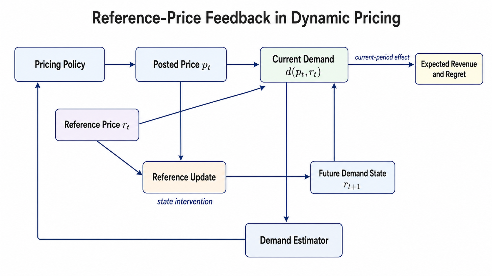
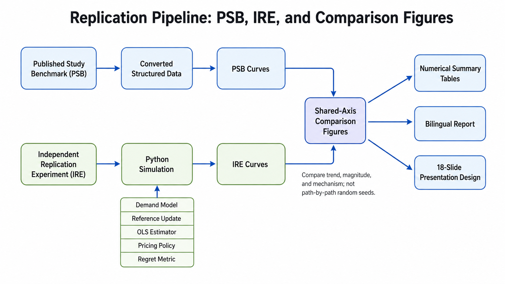
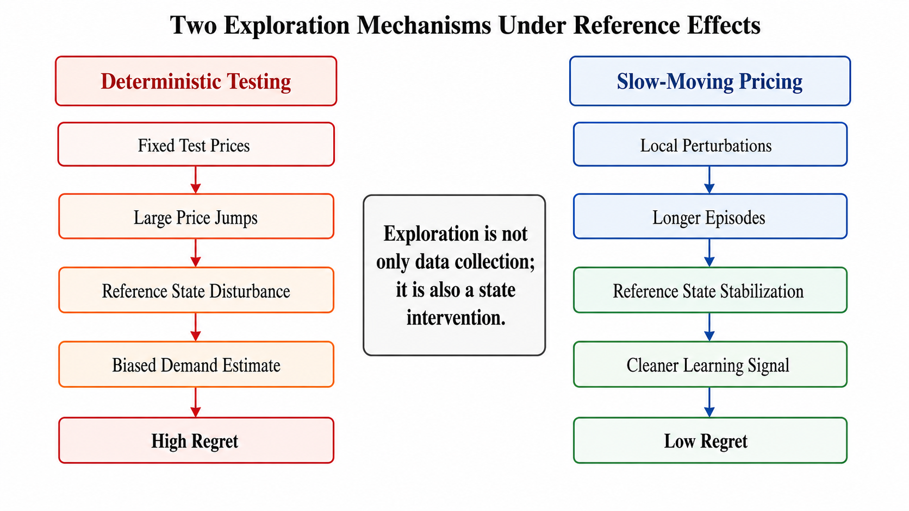
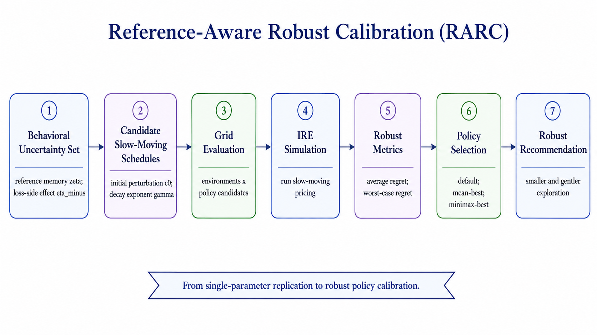
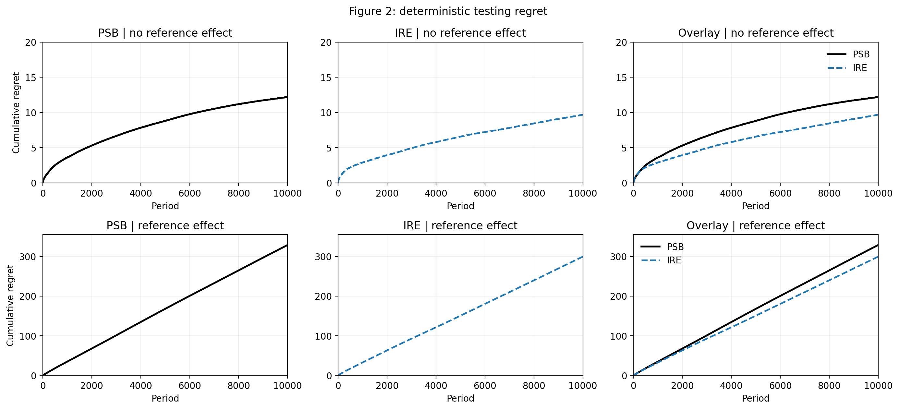
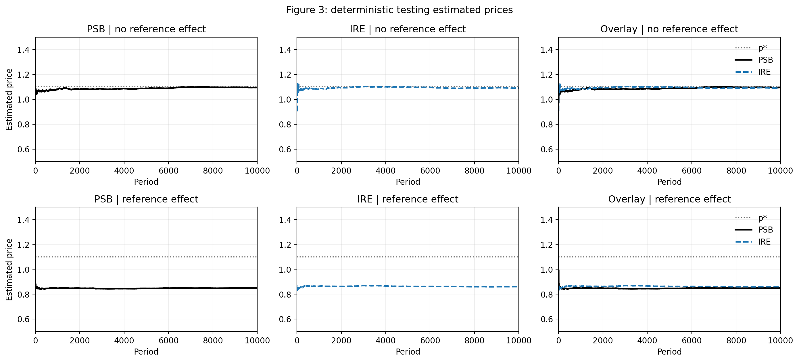
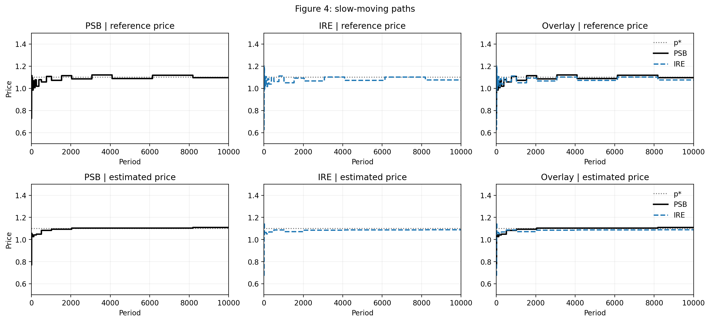
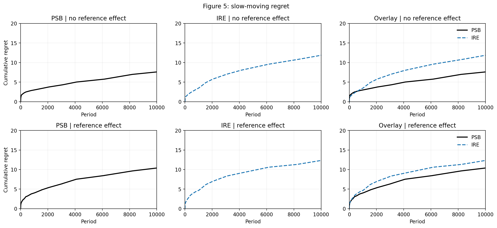
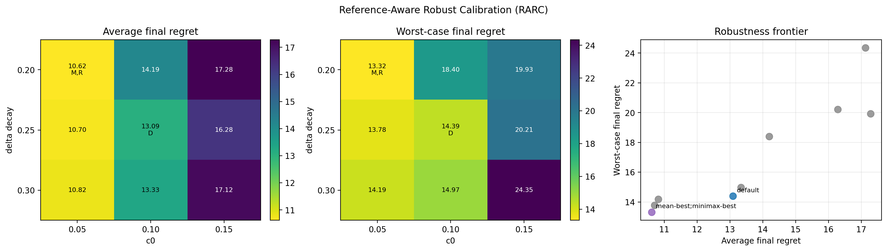

# 18页PPT设计思路

## 汇报定位

本汇报面向运筹学论文复现期末展示，目标时长约 10 分钟，18 页。主线不是逐行解释代码，而是说明一个运筹学问题如何从理论机制、数值复现、结果对比推进到扩展优化实验。

核心叙事为：价格具有记忆效应，因此动态定价中的探索不仅收集信息，也会改变未来需求状态；普通 deterministic testing 在参考价格效应下失效，而 slow-moving pricing 通过平滑探索控制状态扰动；本项目进一步提出 RARC 扩展，考察不确定参考效应下的稳健策略校准。

## 术语约定

首次出现时使用正式名称：

- Published Study Benchmark (PSB)：已发表研究提供的数值基准。
- Independent Replication Experiment (IRE)：本项目独立实现并重新运行的复现实验。
- Reference-Aware Robust Calibration (RARC)：本项目新增的参考价格感知稳健校准扩展实验。

后续页面统一使用 PSB、IRE 和 RARC。图例和讲稿中避免使用非正式简称。

## 视觉与图表原则

- 实验结果页采用三联图：左侧 PSB，右侧 IRE，下方或右侧 Overlay 对比。这样可以同时满足“论文结果、本项目结果、同坐标系比较”三种阅读需求。
- PPT 制作统一使用 `ppt-design/figure/` 下的图片包，避免后续打包时跨目录丢图。
- Figure 2-5 使用 `figure/figure2_comparison.png` 到 `figure/figure5_comparison.png`。
- RARC 数值结果使用 `figure/robust_calibration.png`，重点展示候选参数在平均 regret 和最坏情形 regret 下的排序。
- 新增流程图/架构图使用 `figure/reference_feedback.png`、`figure/replication_pipeline.png`、`figure/exploration_mechanisms.png` 和 `figure/rarc.png`，分别服务于问题机制、复现流程、策略机制和扩展实验设计。
- 每页只保留一个主结论，图表页用一句话解释机制，避免把图注、参数和结论全部堆在同一区域。
- 配色建议采用白底、深灰正文、克制蓝色强调线、橙色或红色标注风险曲线；PSB 与 IRE 用固定颜色，Overlay 页保持同一图例。

## PPT图片素材清单

以下图片均已放入 `ppt-design/figure/`，后续使用 ppt-agent 制作 PPT 时可以直接引用。

| 用途 | 文件链接 | 建议页码 | 预览 |
|---|---|---|---|
| 参考价格反馈机制 | [figure/reference_feedback.png](figure/reference_feedback.png) | Slide 2, Slide 6 |  |
| 复现实验管线 | [figure/replication_pipeline.png](figure/replication_pipeline.png) | Slide 9 |  |
| 策略机制对比 | [figure/exploration_mechanisms.png](figure/exploration_mechanisms.png) | Slide 8, Slide 15 |  |
| RARC 扩展流程 | [figure/rarc.png](figure/rarc.png) | Slide 16 |  |
| Figure 2 regret 对比 | [figure/figure2_comparison.png](figure/figure2_comparison.png) | Slide 11 |  |
| Figure 3 估计价格对比 | [figure/figure3_comparison.png](figure/figure3_comparison.png) | Slide 12 |  |
| Figure 4 状态路径对比 | [figure/figure4_comparison.png](figure/figure4_comparison.png) | Slide 13 |  |
| Figure 5 regret 对比 | [figure/figure5_comparison.png](figure/figure5_comparison.png) | Slide 14 |  |
| RARC 数值结果 | [figure/robust_calibration.png](figure/robust_calibration.png) | Slide 17 |  |

## 18页结构

| 页码 | 页标题 | 核心信息 | 推荐视觉材料 | 时间 |
|---|---|---|---|---|
| 1 | 标题页 | 论文复现与稳健扩展的主题、课程、姓名信息 | 标题 + 简洁副标题 | 0:20 |
| 2 | 一句话问题 | 价格会改变未来消费者的参考点 | [reference_feedback.png](figure/reference_feedback.png) | 0:25 |
| 3 | 背景与动机 | 参考价格使价格实验不再是中性的统计采样 | 促销价、正常价、心理参考点示意 | 0:30 |
| 4 | 运筹学视角 | 问题本质是 learning、earning 与 state control 的联合设计 | 三角关系图 | 0:30 |
| 5 | 需求模型 | 需求由当前价格、参考价差和随机扰动共同决定 | 分段需求公式 + gain/loss 两侧标注 | 0:35 |
| 6 | 参考价格与 regret | 参考价格通过指数平滑更新，regret 衡量累计收益损失 | [reference_feedback.png](figure/reference_feedback.png) 局部放大 | 0:35 |
| 7 | 理论直觉 | 固定价格足够久时，参考价格会收敛到当前价格 | 收敛曲线或状态轨迹示意 | 0:30 |
| 8 | 策略对比 | deterministic testing 快速试探，slow-moving pricing 平滑试探 | [exploration_mechanisms.png](figure/exploration_mechanisms.png) | 0:30 |
| 9 | 复现命名与流程 | PSB 与 IRE 的来源、转换、仿真、绘图流程 | [replication_pipeline.png](figure/replication_pipeline.png) | 0:30 |
| 10 | 实验设置 | 参数、价格区间、时间长度、场景分类 | 参数表与两类场景标签 | 0:30 |
| 11 | Figure 2：regret | deterministic testing 在参考效应下 regret 明显放大 | [figure2_comparison.png](figure/figure2_comparison.png) | 0:40 |
| 12 | Figure 3：估计价格 | 参考效应会造成最优价估计偏移 | [figure3_comparison.png](figure/figure3_comparison.png) | 0:40 |
| 13 | Figure 4：状态路径 | slow-moving 下参考价格与估计价格逐步回到合理区域 | [figure4_comparison.png](figure/figure4_comparison.png) | 0:40 |
| 14 | Figure 5：低 regret | slow-moving 在两个场景中维持较低 regret | [figure5_comparison.png](figure/figure5_comparison.png) | 0:40 |
| 15 | 机制总结 | 关键差异是是否把探索视为会改变状态的干预 | [exploration_mechanisms.png](figure/exploration_mechanisms.png) | 0:35 |
| 16 | RARC 扩展设计 | 在参考记忆和损失侧参考效应不确定时校准扰动参数 | [rarc.png](figure/rarc.png) | 0:40 |
| 17 | RARC 扩展结果 | 更小扰动、更慢衰减在测试集内取得更好稳健表现 | [robust_calibration.png](figure/robust_calibration.png) | 0:40 |
| 18 | 结论与展望 | 学习与状态控制必须共同设计；扩展到理论、算法和应用 | 三条 takeaways + future work | 0:30 |

## 讲述节奏

第 1-4 页建立问题意识：不要急于给公式，先说明为什么参考价格会让动态定价更难。

第 5-8 页讲清模型和理论直觉：重点是需求分段结构、参考价格状态更新，以及 slow-moving 为什么能控制状态污染。

第 9-14 页展示复现证据：每页只围绕一个 Figure 的主要发现讲，不需要解释所有曲线细节。Figure 2 和 3 负责说明失败机制，Figure 4 和 5 负责说明修正机制。

第 15-17 页完成从复现到扩展的过渡：先抽象机制，再引入 RARC，把问题从“能否复现论文现象”推进到“不确定环境下如何选择策略参数”。

第 18 页收束：强调运筹学意义、方法优势、局限性和未来扩展，不再加入新结果。

## 每页讲述重点

1. 标题页：明确这是论文复现加扩展优化实验。
2. 一句话问题：今天的价格会影响明天的需求状态。
3. 背景与动机：参考点让消费者对涨价和降价产生不对称反应。
4. 运筹学视角：这是动态决策、统计学习和状态控制的交叉问题。
5. 需求模型：公式中的 `eta_plus` 和 `eta_minus` 对应 gain/loss 两侧。
6. 参考价格与 regret：收入评价基于期望需求，避免混入仿真噪声。
7. 理论直觉：固定价格一段时间可以让参考价误差衰减。
8. 策略对比：普通试探快但扰动大，slow-moving 慢但更稳。
9. 复现命名与流程：PSB 是基准，IRE 是本项目独立复现。
10. 实验设置：参数取值、价格区间和场景与复现目标保持一致。
11. Figure 2：deterministic testing 在 reference-effect 场景中失败。
12. Figure 3：失败来自估计最优价长期偏低。
13. Figure 4：slow-moving 使估计价格和参考价格逐步稳定。
14. Figure 5：平滑探索把 regret 控制在低量级。
15. 机制总结：探索是系统干预，不只是数据采样。
16. RARC 设计：从单一参数复现转向不确定环境下的策略校准。
17. RARC 结果：`c0 = 0.05`、`decay = 0.20` 在平均和最坏情形指标上表现最好。
18. 结论与展望：总结贡献，说明局限，并提出理论、算法和应用方向。

## 备用问答

- 为什么不追求 PSB 与 IRE 曲线逐点一致？因为随机种子与仿真实现不同，复现重点是策略机制、趋势和数量级。
- 为什么 RARC 有运筹学意义？它把策略参数选择写成不确定环境下的校准问题，关注平均表现与最坏情形风险的权衡。
- slow-moving 的代价是什么？它为了控制状态扰动牺牲了探索速度，在需求结构更复杂时可能需要自适应扰动设计。
